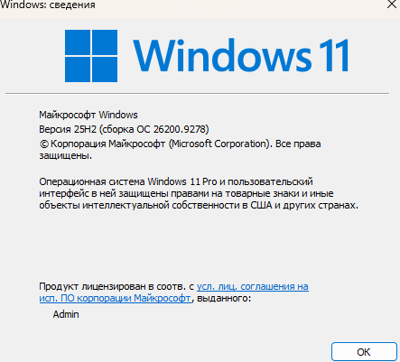
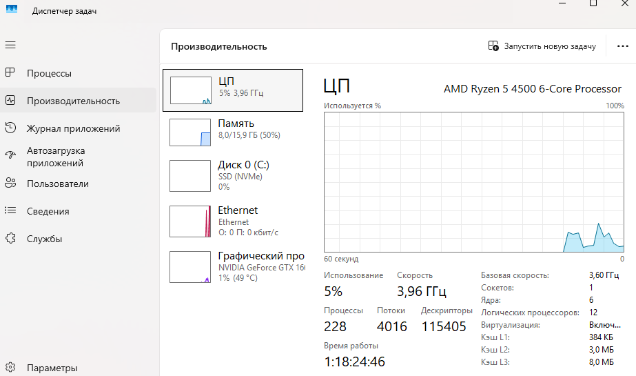
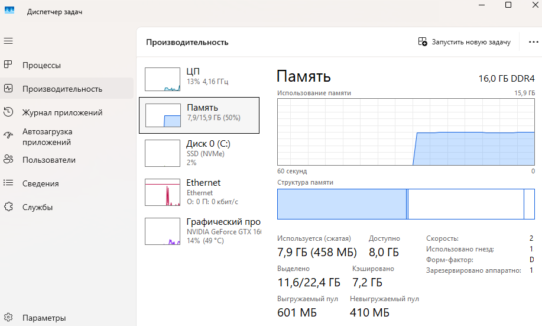
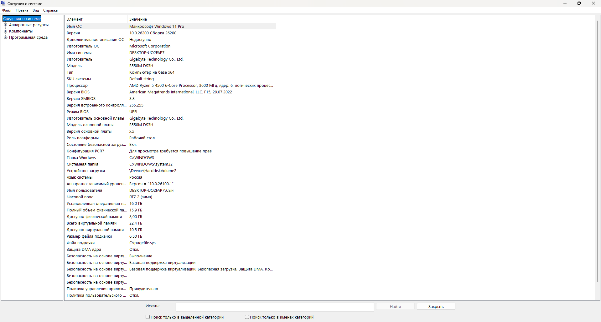
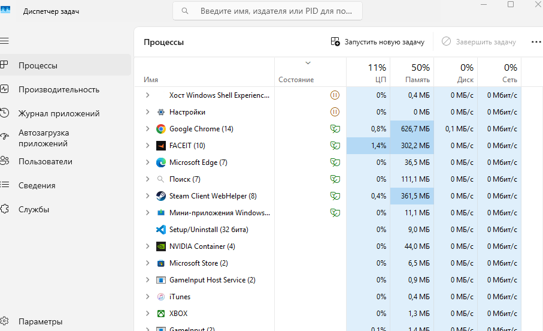

# Исследование системы

## Использованные инструменты

1. **winver** — команда в окне «Выполнить» (Win + R)
2. **Параметры** → Система → О системе
3. **Диспетчер задач** (Ctrl + Shift + Esc) — вкладки «Производительность» и «Процессы»
4. **msinfo32** — команда в окне «Выполнить» (Win + R)

## Проверка данных двумя способами

| Характеристика | Способ 1 | Способ 2 | Совпало? |
|----------------|----------|----------|----------|
| Версия Windows | winver: 25H2 / 26200.9278 | msinfo32: 25H2 / 26200.9278 | Да |
| Модель процессора | Параметры: AMD Ryzen 5 4500 | Диспетчер задач: AMD Ryzen 5 4500 | Да |
| Объём RAM | Параметры: 16.0 ГБ | Диспетчер задач: 16.0 ГБ | Да |

Все характеристики совпадают. Расхождений нет.

*На скриншоте из «Параметров» виден процессор AMD Ryzen 5 4500 и 16 ГБ оперативной памяти.*

*В Диспетчере задач отображается тот же процессор AMD Ryzen 5 4500 с 6 ядрами.*

*Диспетчер задач показывает 16 ГБ оперативной памяти, скорость 2666 МТ/с.*

*В msinfo32 указана версия ОС, процессор и объём памяти — всё совпадает с предыдущими способами.*

## Процессы

Из Диспетчера задач выбраны три процесса, работающие на момент проверки:

| Процесс | Назначение | CPU | Память |
|---------|------------|-----|--------|
| System | Ядро ОС и системные службы | 0.1% | 0.1 МБ |
| Registry | Управление реестром Windows | 0% | 1.2 МБ |
| Memory Compression | Сжатие оперативной памяти для экономии | 0.1% | 12.5 МБ |

На скриншоте ниже видно, что одновременно запущены десятки процессов. Это прямое доказательство многозадачности ОС.

*На вкладке «Процессы» виден список работающих приложений и фоновых процессов с их нагрузкой на CPU и память.*

## Ответы на вопросы

**Что относится к пользовательскому пространству?**
К пользовательскому пространству относятся все приложения и программы, которые запускает пользователь — браузеры, игры, текстовые редакторы, мессенджеры. Они работают в изолированном режиме и не имеют прямого доступа к аппаратному обеспечению компьютера.

**Зачем ОС управляет CPU/RAM/диском/устройствами?**
Операционная система распределяет ресурсы между программами, чтобы они могли работать одновременно и не мешать друг другу. Она контролирует, сколько процессорного времени и памяти получает каждое приложение, управляет доступом к диску и устройствам ввода-вывода. Без этого программы бы конфликтовали и система работала нестабильно.

**Где я наблюдаю работу ОС как посредника?**
В Диспетчере задач видно, как ОС распределяет процессорное время между всеми запущенными процессами. Если открыть тяжёлую программу, загрузка CPU растёт, и ОС автоматически перераспределяет ресурсы в пользу активного приложения, а фоновые процессы получают меньше ресурсов. Это и есть работа ОС как посредника между программами и железом.